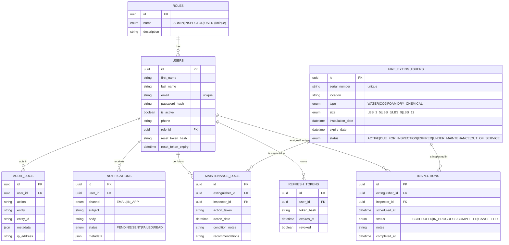

# Entity-Relationship Model — TZW FEMS

## Mermaid ERD

## Relationships summary

| Parent | Child | Cardinality | FK | On delete |
|---|---|---|---|---|
| `roles` | `users` | 1 → N | `users.role_id` | restrict |
| `users` | `refresh_tokens` | 1 → N | `refresh_tokens.user_id` | cascade |
| `users` | `inspections` | 1 → N | `inspections.inspector_id` | restrict |
| `users` | `maintenance_logs` | 1 → N | `maintenance_logs.inspector_id` | restrict |
| `users` | `notifications` | 1 → N | `notifications.user_id` | cascade |
| `fire_extinguishers` | `inspections` | 1 → N | `inspections.extinguisher_id` | cascade |
| `fire_extinguishers` | `maintenance_logs` | 1 → N | `maintenance_logs.extinguisher_id` | cascade |

## Indexes (performance)

* `users(email)` unique, `users(role_id)`
* `fire_extinguishers(serial_number)` unique, `(status)`, `(type)`
* `inspections(extinguisher_id)`, `(inspector_id)`, `(status)`
* `maintenance_logs(extinguisher_id)`, `(inspector_id)`
* `refresh_tokens(user_id)`; `notifications(user_id)`, `(status)`

The canonical definition lives in [`prisma/schema.prisma`](../prisma/schema.prisma).
